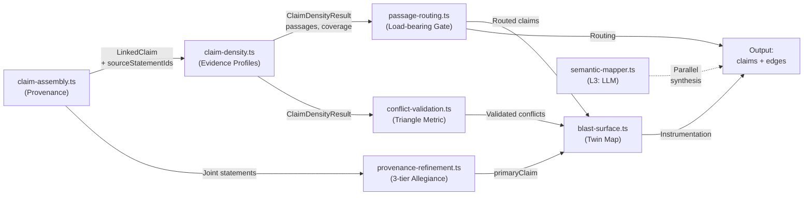

# Blast Radius — Logical Flow (Mermaid)

**File-by-file breakdown:**

- `claim-assembly.ts` — 4-phase reconstruction: similarity matrix → competitive assignment → mixed-method merge → LinkedClaim construction
- `claim-density.ts` — Pure L1: passage detection (contiguous runs), coverage aggregates, model grouping
- `passage-routing.ts` — Load-bearing classification: structural contributors → concentration/density ratios → landscape gates (northStar/eastStar/mechanism/floor)
- `conflict-validation.ts` — Two-pass validation: exclusive statements → cross-pool proximity → triangle residual threshold
- `provenance-refinement.ts` — 3-tier allegiance signal: calibration pool → centroid fallback → passage dominance
- `blast-surface.ts` — Twin map (reciprocal best-match) + risk vectors (deletion, degradation, cascade fragility, isolation)
- `semantic-mapper.ts` — L3 LLM path: cross-read synthesis, independent of deterministic pipeline
